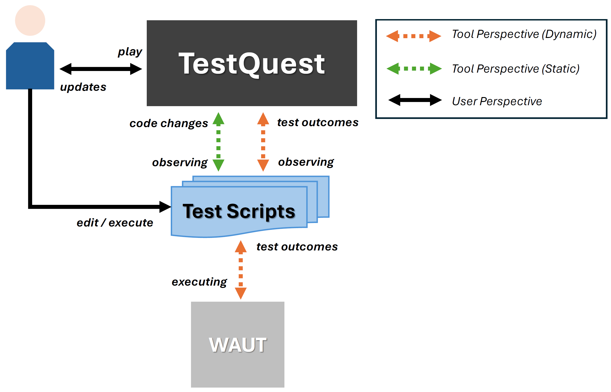

# TestQuest

## Approach
TestQuest is a Kotlin plugin for IntelliJ IDEA designed to enhance test robustness through an embedded gamification framework, based on Selenium WebDriver APIs, with a focus towards locators and PageObjects. 

TestQuest relies on a task-driver approach, where tasks to complete are based on test robustness best practices identified in the literature, synthesized in the following Tables.

### Locator Guidelines

| ID  | Description                                                                 |
|-----|-----------------------------------------------------------------------------|
| L1  | Prioritize `ID` and `XPath` locators                                       |
| L2  | Prioritize `XPath` locators with predicates about `id`, `name`, `class`, `title`, `alt`, and `value` properties |
| L3  | Keep number of positional predicates and levels in XPath locators as few as possible |
| L4  | Keep locator values readable and short                                     |
| L5  | Avoid using absolute `XPath` locators                                      |
| L6  | Avoid `XPath` locators with predicates about internal app structure (e.g., `href`) or Javascript code (e.g., `onClick`) |

### Page Object Guidelines

| ID  | Description                                                                 |
|-----|-----------------------------------------------------------------------------|
| P1  | Avoid exposing locator details outside Page Objects                        |
| P2  | Avoid implementing unused locators within Page Objects                     |
| P3  | Avoid methods implementing test logic in Page Objects (e.g., assertions, conditional statements) |
| P4  | Implement multiple Page Object methods to model multiple expected outcomes (e.g., `loginOK` and `loginKO`) |
| P5  | Introduce Page Object ancestors to share common functionalities            |
| P6  | Add Page Objects as return types to methods to model the user's exploration |

The process describing how TestQuest works is sketched in the following Figure.

The TestQuest main class is implemented as an IntelliJ custom action, enabling the plugin in the target test project. TestQuest scans test-related files to extract information on locators and Page Objects using dedicated extractors. Locators follow the Selenium WebDriver model and are represented as Kotlin data classes containing _type_, _value_, and _code location_. Page Objects are structured with _names_, _ancestors_, and _method lists_, where methods include metadata like _parameters_, _return types_ and _associated locators_.

Extracted data are used both to assess test suite quality (based on specific metrics) and to drive gamification. TestQuest currently offers **50** daily tasks (**30** on locators, **20** on Page Objects) and **29** achievements to encourage user engagement and good practices.

## Modules
TestQuest is composed by the following main modules:  
- [Gamification](./src/main/kotlin/gamification/): ...
- [Listener](./src/main/kotlin/listener/): ... 
- [Locator](./src/main/kotlin/analyzer/): ...
- [UI](./src/main/kotlin/ui/): ...
- [Utils](./src/main/kotlin/utils/): ...

## Usage
To install and use TestQuest into your IntelliJ test project:

- Import **Gamification Library** _jar_ used to intercept test events: 
    - `Project Structure` > `Project Settings` > `Libraries`
    - From the `Modules` panel to the right, under the `Dependencies` section, add _gamification-library.jar_ via `+` button, then confirm
    - In this repository we provided a _jar_ file that supports Java 20, see more at [Gamification Library project](https://github.com/Paolobd/gamification-library))
- Import **TestQuest Library** _zip_: 
    - `File` > `Settings` > `Plugin` > click the engine symbol > `Import from File system` 
    - From the panel, add _testquest.zip_ provided in this repository (or create your own zip by ...)
- Be sure that: 
    - All test artifacts (test cases, Page Objects) are stored under a _test_ folder
    - Test cases are named as _testCaseName_\_Test
    - Page Objects are named as _pageObjectName_\_Page 
    - All locators are declared in their full form (i.e., `WebElement locatorName = driver.findElement(By.locatorStrategy(...))`)

