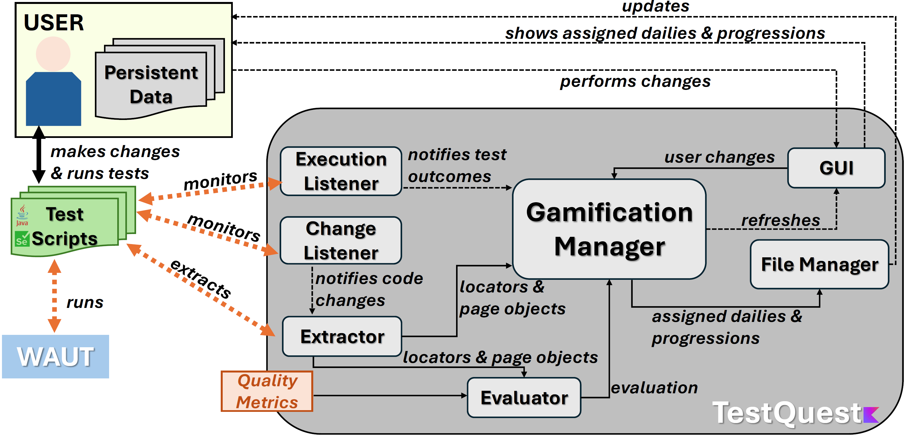

# TestQuest

TestQuest is a Kotlin plugin for IntelliJ IDEA designed to enhance test robustness through an embedded gamification framework, based on Selenium WebDriver APIs, with a focus towards locators and PageObjects. 

## Guidelines

TestQuest relies on a task-driver approach, where tasks to complete are based on test robustness best practices identified in the literature, synthesized as follows.

### Locator Guidelines

| ID  | Description                                                                 |
|-----|-----------------------------------------------------------------------------|
| L1  | Prioritize `ID` and `XPath` locators                                        |
| L2  | Prioritize `XPath` locators with predicates about `id`, `name`, `class`, `title`, `alt`, and `value` properties |
| L3  | Keep number of positional predicates and levels in XPath locators as few as possible |
| L4  | Keep locator values readable and short                                      |
| L5  | Avoid using absolute `XPath` locators                                       |
| L6  | Avoid `XPath` locators with predicates about internal app structure (e.g., `href`) or Javascript code (e.g., `onClick`) |

### Page Object Guidelines

| ID  | Description                                                                 |
|-----|-----------------------------------------------------------------------------|
| P1  | Avoid exposing locator details outside Page Objects                         |
| P2  | Avoid implementing unused locators within Page Objects                      |
| P3  | Avoid methods implementing test logic in Page Objects (e.g., assertions, conditional statements) |
| P4  | Implement multiple Page Object methods to model multiple expected outcomes (e.g., `loginOK` and `loginKO`)               |
| P5  | Introduce Page Object ancestors to share common functionalities             |
| P6  | Add Page Objects as return types to methods to model the user's exploration  |

## Approach

The process describing how TestQuest works is sketched in the following Figure.

  

The TestQuest main class is implemented as an IntelliJ custom action, enabling the plugin in the target test project. TestQuest scans test-related files to extract information on locators and Page Objects using dedicated extractors. Locators follow the Selenium WebDriver model and are represented as Kotlin data classes containing _type_, _value_, and _code location_. Page Objects are structured with _names_, _ancestors_, and _method lists_, where methods include metadata like _parameters_, _return types_ and _associated locators_.

Extracted data are used both to assess test suite quality (based on specific metrics) and to drive gamification. TestQuest currently offers **50** daily tasks (**30** on locators, **20** on Page Objects) and **29** achievements to encourage user engagement and good practices.

## Modules
TestQuest is composed by the following main modules:  
- [analyzer](./src/main/kotlin/analyzer/): this module is responsible for evaluating locators and Page Objects according to quality metrics. The evaluation is used to rate locators fragility and activate dailies targeted to fix found issues 
- [extractor](./src/main/kotlin/extractor/): this module is responsible for extracting locator and Page object data from test artifacts for the evaluation
- [gamification](./src/main/kotlin/gamification/): this module is responsible for defining and assigning tasks to users and keeping track of user progressions 
- [listener](./src/main/kotlin/listener/): this module is responsible for capturing static and dynamic changes affecting test artifacts and test executions, eventually activating the gamification procress
- [testquest](./src/main/kotlin/testquest/): this module is responsible for initializing the plugin and the whole gamification process
- [ui](./src/main/kotlin/ui/): this module is responsible for the plugin interface, including the Gamification and Fragility windows, displaying user data, progressions, and all related notifications
- [utils](./src/main/kotlin/utils/): this modules is responsible for utility functions, including the management of the user progression through I/O operations

---

## Usage
To use TestQuest into your IntelliJ test project:
- Import TestQuest Plugin: 
    - Open the test project in Intellij
    - Select `File` > `Settings` > `Plugin` > click the engine symbol > `Import from File system` 
    - From the panel, select _testquest.zip_ provided in this repository under the _dist_ folder 
      - You can create your own zip copy of TestQuest by running `./gradlew buildPlugin` from TestQuest project terminal. The zip copy can be found under `build/distributions`
    - Select `Gamify` > `TestQuest` to start the plugin 
- You can now create and modify test artifacts with TestQuest active. Progressions are saved under the IntelliJ data folder of your machine (e.g., `\AppData\Roaming\JetBrains\IdeaIC2023.2\testquest` in Windows). 
- Be sure that: 
    - All test artifacts in the test project (test cases, Page Objects) are stored under a _test_ folder
    - Test cases are named as _testCaseName_\_Test
    - Page Objects are named as _pageObjectName_\_Page 
    - All locators are declared in their full form (i.e., `WebElement locatorName = driver.findElement(By.locatorStrategy(...))`)
    - All changes on test cases and Page Objects are positively validated by test execution (e.g., changing a locator that breaks will not provide any progress)

TestQuest plugin is written in Kotlin and built targeting Java 17 (JVM) and IntelliJ IDEA 2023.2.x (build 232.*) or later versions.